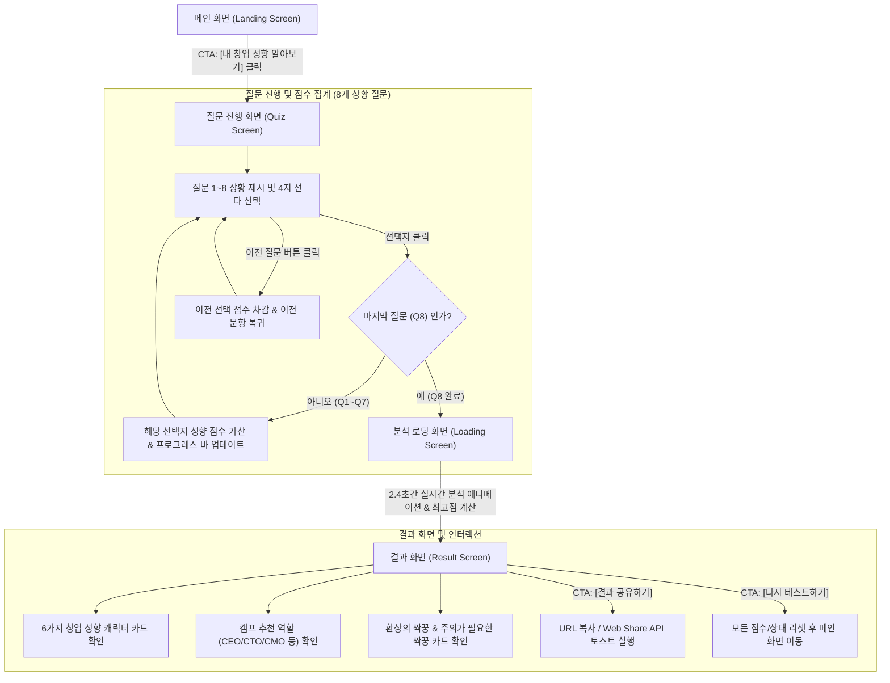

# [PRD] 대학생 창업 성향 테스트 웹사이트 (Startup Personality Test)

> **문서 버전**: v1.0  
> **작성자**: 대학생 창업 교육 전문 기획자  
> **최종 수정일**: 2026-07-29  
> **상태**: 승인 완료 및 개발 진행 (Approved)

---

## 1. 프로젝트 개요 (Overview)

### 1.1 배경 및 목적
* **배경**: 대학생 대상 창업 캠프나 팀 빌딩 워크숍 시, 참가자들이 자신의 성향과 강점을 객관적으로 파악하지 못한 상태에서 팀을 구성하면 역할 분담 갈등이나 시너지 부재가 발생합니다.
* **목적**: 
  1. 창업 캠프 참가자가 흥미롭고 직관적인 상황 상황 제시형 테스트를 통해 자신의 **창업 성향 및 강점**을 발견하도록 지원합니다.
  2. 자신과 시너지를 낼 수 있는 팀원 궁합 및 추천 역할(CEO, CTO, CMO, COO 등)을 제시하여 **효율적인 팀 빌딩**을 유도합니다.

### 1.2 주요 목표 (KPI)
* **테스트 완료율**: 진입 사용자 대비 테스트 완료율 85% 이상 (약 2~3분 내 완료 가능한 문항 설계)
* **결과 공유율**: 결과 페이지 공유 (링크/SNS) 비율 30% 이상
* **사용자 만족도**: "팀 역할 정하기에 도움이 되었다" 응답 90% 이상

---

## 2. 타겟 유저 정의 (Target Audience)

| 구분 | 주요 특징 | Pain Point | 원하는 해결책 |
| :--- | :--- | :--- | :--- |
| **주 타겟 (대학생 창업 캠프 참가자)** | • 모바일/웹 환경에 익숙한 MZ 세대<br>• 창업에 관심이 있으나 자신의 구체적 역할 불명확 | • "내가 팀에서 뭘 잘할 수 있을지 모르겠어요"<br>• 지루한 검사는 도중에 이탈함 | • 3분 이내로 끝나는 재미있고 예쁜 테스트<br>• SNS에 공유하고 싶은 명확한 캐릭터 카드 |
| **보조 타겟 (창업 캠프 운영진/멘토)** | • 짧은 시간 안에 참가자들의 성향 분포를 파악해야 함 | • 팀 빌딩 시 동질 성향만 모이는 현상 방지 필요 | • 참가자들이 서로 성향 결과를 공유하고 팀을 짜도록 유도할 수 있는 도구 |

---

## 3. 창업 성향 6가지 결과 유형 (Archetype Framework)

테스트 결과는 6가지 주요 창업 성향 유형으로 진단됩니다.

```
       [ 전략형 (Strategist/CEO) ]           [ 아이디어형 (Innovator/CPO) ]
                    \                             /
                     \                           /
    [ 분석형 (Analyst/CFO) ] --- [ 유형 6종 ] --- [ 제작형 (Builder/CTO) ]
                     /                           \
                    /                             \
     [ 실행형 (Driver/COO) ]               [ 협업형 (Facilitator/HR) ]
```

1. **아이디어형 (The Spark Innovator / CPO)**
   * **특징**: 세상을 바꿀 새로운 아이디어가 끊임없이 샘솟는 기획가.
   * **추천 역할**: Product Lead / CPO / 아이디어 기획자
   * **환상의 짝꿍**: 실행형 (Driver) | **상극 짝꿍**: 분석형 (Analyst)
2. **제작형 (The Tech Builder / CTO)**
   * **특징**: 아이디어를 직접 눈에 보이는 프로토타입이나 제품으로 구현해내는 실력파.
   * **추천 역할**: CTO / Tech Lead / 디자이너·개발자
   * **환상의 짝꿍**: 아이디어형 (Innovator) | **상극 짝꿍**: 전략형 (Strategist)
3. **전략형 (The Business Strategist / CEO)**
   * **특징**: 전체적인 비즈니스 모델과 비전을 그리며 팀의 방향을 결정하는 리더.
   * **추천 역할**: CEO / Founder / 사업개발(BD)
   * **환상의 짝꿍**: 분석형 (Analyst) | **상극 짝꿍**: 제작형 (Builder)
4. **협업형 (The People Facilitator / HR·CMO)**
   * **특징**: 팀원 간의 소통을 원활하게 하고 마케팅과 네트워크를 주도하는 분위기 메이커.
   * **추천 역할**: CMO / HR / 커뮤니티 매니저
   * **환상의 짝꿍**: 전략형 (Strategist) | **상극 짝꿍**: 실행형 (Driver)
5. **분석형 (The Data Analyst / CFO)**
   * **특징**: 객관적인 데이터와 시장 분석을 통해 리스크를 줄이고 타당성을 검증하는 분석가.
   * **추천 역할**: CFO / Market Researcher / 데이터 분석가
   * **환상의 짝꿍**: 전략형 (Strategist) | **상극 짝꿍**: 아이디어형 (Innovator)
6. **실행형 (The Operation Driver / COO)**
   * **특징**: 목표가 설정되면 일의 순서를 정하고 빠르게 추진하여 성과를 내는 행동파.
   * **추천 역할**: COO / Project Manager / 운영 팀장
   * **환상의 짝꿍**: 아이디어형 (Innovator) | **상극 짝꿍**: 협업형 (Facilitator)

---

## 4. 화면 흐름 및 사용자 여정 (Screen Flow & User Journey)

### 4.1 테스트 진행 프로세스 Mermaid 순서도
전체 웹사이트 사용자 흐름 및 시스템 로직을 나타낸 플로우차트입니다.



### 4.2 단계별 화면 진행 상세

1. **[단계 1] 메인 랜딩 화면 (Landing Screen)**
   * **사용자 행동**: 웹사이트 접속 후 타이틀, 주요 특징 카드, 누적 검사자 수 확인 후 `[내 창업 성향 알아보기]` 버튼 클릭.
   * **화면 전환**: Smooth Slide-up 애니메이션과 함께 질문 진행 화면으로 이동.

2. **[단계 2] 질문 진행 화면 (Quiz Screen)**
   * **사용자 행동**: 8개 창업 해커톤/캠프 실전 상황 질문을 읽고 4개 선택지 중 하나 선택.
   * **시스템 로직**: 선택한 항목의 성향 점수(1~2점)가 가산되며, 상단 프로그레스 바(예: `12%` → `25%` → ... → `100%`)가 즉시 갱신됨. `[이전 질문]` 버튼으로 언제든 이전 선택 수정 가능.

3. **[단계 3] 분석 로딩 화면 (Loading Screen)**
   * **사용자 행동**: 8번 문항 답변 제출 직후 자동 진입하여 2~3초간 대기.
   * **시스템 로직**: 파티클 애니메이션과 함께 대기 텍스트("창업 캠프에서의 당신의 행동 패턴을 분석하는 중..." → "팀원과의 시너지 및 찰떡 궁합을 계산하는 중...")가 순차 갱신된 후, 최고점 성향 결과 데이터를 매핑함.

4. **[단계 4] 최종 결과 화면 (Result Screen)**
   * **사용자 행동**: 나만의 창업 성향 캐릭터, 강점/보완점, 캠프 추천 역할, 팀원 궁합 카드(환상의 짝꿍/상극 짝꿍) 확인.
   * **추가 액션**: `[결과 공유하기]` 버튼으로 클립보드 링크 복사 또는 `[다시 테스트하기]`로 처음부터 재진행.

---

## 5. 서비스 기능 명세 (Functional Specifications)

### 5.1 메인 화면 (Landing Screen)
* **타이틀 및 서브헤딩**: "나는 창업 팀에서 어떤 역할일까? 대학생 창업 성향 테스트"
* **시각적 요소**: 감각적인 일러스트/그라디언트 카드 패널, 스타트업 아이콘 애니메이션.
* **주요 CTA 버튼**: `[내 창업 성향 알아보기]` (클릭 시 질문 화면 진입)
* **부가 정보**: 예상 소요 시간(약 2분), 누적 테스트 진행 수 표시.

### 5.2 질문 진행 화면 (Question Screen)
* **상태 표시줄 (Progress Bar)**: 현재 진행 단계 (예: `3 / 8` 질문) 및 진행률 퍼센트 애니메이션.
* **상황 제시형 질문 카드**: 대학생 창업 캠프에서 실제로 겪을 만한 리얼한 상황 8문항.
* **4지 선다 선택지**: 각 질문별 4개의 선택지 (클릭 시 누적 점수 계산 후 다음 질문으로 자동 전환).
* **이전/다음 버튼**: 실수로 잘못 선택했을 때 이전 질문으로 돌아가는 기능.

### 5.3 결과 화면 (Result Screen)
* **유형 결과 카드**:
  * 성향 이름, 한 줄 요약 및 캐릭터 카드 아이콘
  * 성향 상세 설명 (특징, 강점 3가지, 주의할 점 2가지)
* **창업 캠프 맞춤 가이드**:
  * **캠프 추천 역할**: (예: CEO, CTO, CMO 등)
  * **환상의 짝꿍 (Best Synergy)**: 시너지가 극대화되는 성향 카드 & 이유
  * **상극 궁합 (Challenging Partner)**: 주의가 필요한 성향 카드 & 협업 팁
* **인터랙티브 기능**:
  * `[결과 공유하기]` (URL 복사 / Web Share API 지원)
  * `[다시 테스트하기]` (상태 리셋 후 메인으로 이동)

---

## 6. 질문 알고리즘 및 데이터 구조 (Scoring Logic)

### 6.1 점수 합산 알고리즘
1. 총 8문항으로 구성되며, 각 답변은 특정 성향 점수(아이디어, 제작, 전략, 협업, 분석, 실행)를 1~2점 가산합니다.
2. 8번 질문까지 완료되면 6가지 성향의 최종 누적 점수를 계산합니다.
3. 가장 높은 점수를 획득한 성향이 최종 **메인 성향**으로 결정됩니다. (동점 시 가중치 질문 또는 우선순위 로직으로 결정)

### 6.2 문항 데이터 예시 (8문항 구조)
1. **Q1. 창업 해커톤 첫날, 아이디어를 정할 때 나는?**
   * A1. 혁신적이고 아무도 안 해본 신기한 아이디어를 계속 쏟아낸다. (아이디어형 +2)
   * A2. 실제로 해커톤 기간 내 구현 가능한 기술인지 먼저 검토한다. (제작형 +2)
   * A3. 시장 규모와 수익성, 사업화 가능성을 먼저 따져본다. (전략형 +2)
   * A4. 팀원들의 아이디어를 조율하고 다 같이 즐겁게 결정하도록 분위기를 만든다. (협업형 +2)
2. **Q2. 아이디어 피칭 발표 자료(PPT)를 만들 때 내 담당은?**
   * A2. 데이터와 통계 자료, 시장 분석 장표 작성 (분석형 +2)
   * A3. 사업 비전과 핵심 스토리를 기획하는 발표자 (전략형 +2)
   * A4. 팀원들 의견 수집 및 깔끔하고 시각적인 디자이너 역할 (협업형 +2)
   * A1/A6. 와이어프레임 그리기 및 데모 시연 준비 (제작형 +1, 실행형 +1)
*(이와 같은 방식으로 8개 상황 문항 설계)*

---

## 7. UI/UX 디자인 가이드 (Design Aesthetics)

* **디자인 컨셉**: Modern Startup Tech Theme (다크 앤 그라디언트 톤 + 유리 질감 Glassmorphism)
* **컬러 팔레트**:
  * Primary Accent: Neon Violet (`#7C3AED`) & Cyan Blue (`#06B6D4`)
  * Background: Sleek Dark (`#0F172A`, `#1E293B`)
  * Text: High Contrast White (`#F8FAFC`) & Soft Gray (`#94A3B8`)
* **폰트**: Google Fonts - `Pretendard` / `Outfit` / `Inter`
* **마이크로 애니메이션**:
  * 선택지 호버 시 Glow 효과 및 입체 스케일 변환
  * 결과 화면 진입 시 카드 등장 애니메이션 (Scale & Fade In)
  * 프로그레스 바 펄스 효과

---

## 8. 기술 구현 사양 (Technical Specifications)

* **프론트엔드**: HTML5, Modern CSS3 (CSS Variables, Flexbox, Grid, Glassmorphic Effects), Vanilla JavaScript (ES6+)
* **배포 및 호환성**: 모바일 및 데스크톱 웹 브라우저 (Chrome, Safari, Edge, Mobile Web) 100% 반응형 호환
* **의존성 외부 라이브러리 최소화**: 추가 프레임워크 설치 없이 순수 표준 기술로 경량화하여 빠른 로딩 속도 보장.

---

## 9. 획득 가능한 가치 (Expected Impact)

1. **대학생 참가자**: 자신의 직무 적성과 창업 성향을 3분만에 파악하여 캠프 내에서 명확한 역할을 맡을 수 있음.
2. **창업 캠프 운영진**: 팀 구성 시 다양한 성향(기획-개발-전략-마케팅)이 조화롭게 섞인 고성능 팀(High-performing team) 구성 가능.
3. **지속적 활용**: 캠프가 끝난 후에도 팀원 간 성향 이해 및 커뮤니케이션 도구로 지속 활용 가능.

